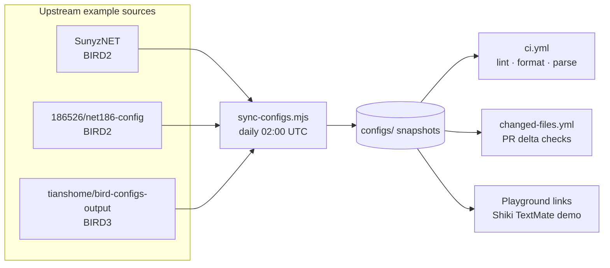

# 🧪 birdcc-ci-test

> Daily-synced BIRD config snapshots that continuously exercise `setup-birdcc` in real GitHub Actions CI.

[](https://github.com/bird-chinese-community/birdcc-ci-test/actions/workflows/ci.yml)
[](https://github.com/bird-chinese-community/birdcc-ci-test/actions/workflows/sync-configs.yml)


English Version | [中文文档](./README.zh.md)

> [Overview](#overview) · [Snapshot Matrix](#snapshot-matrix) · [CI Surface](#ci-surface) · [Daily Sync](#daily-sync) · [Playground Demos](#playground-demos) · [Layout](#layout) · [License Notes](#license-notes)

---

## Overview

`birdcc-ci-test` is the live proving ground for [`bird-chinese-community/setup-birdcc`](https://github.com/bird-chinese-community/setup-birdcc). Instead of only testing tiny synthetic fixtures, this repository mirrors a curated set of real-world BIRD snapshots and re-runs CI against them every day.

It is designed to answer one very practical question:

> Does `setup-birdcc` still behave correctly when pointed at realistic BIRD2/BIRD3 config trees tomorrow morning — not just today?

What this repo does:

- mirrors upstream BIRD example configs into `configs/`
- records source metadata in [`configs/ci-lock.json`](./configs/ci-lock.json)
- runs `birdcc fmt --check`, `birdcc lint --bird`, and direct `bird -p -c` smoke checks
- intentionally avoids `[skip ci]` in the daily sync commit so the scheduled refresh also stress-tests CI stability

> [!NOTE]
> GitHub's web UI still does not provide native BIRD syntax highlighting. This repo works around that by linking to shareable TextMate playground demos using the `bird2` grammar.

## Snapshot Matrix

| Snapshot | Upstream source | BIRD | Local entry | Why it matters |
| --- | --- | --- | --- | --- |
| `sunyznet` | [`SunyzNET/bird-config`](https://github.com/SunyzNET/bird-config) | 2 | `configs/sunyznet/bird.conf` | Flat multi-file include graph with policy/filter definitions |
| `net186` | [`186526/net186-config`](https://github.com/186526/net186-config) | 2 | `configs/net186/bird.conf` | Nested `bird/`, `lib/`, `protocol/`, `util/` layout that exercises directory includes |
| `bird3/nycm1` | [`tianshome/bird-configs-output`](https://github.com/tianshome/bird-configs-output) | 3 | `configs/bird3/nycm1/bird.conf` | Real BIRD3 syntax path for parser, formatter, and installed binary checks |

> [!TIP]
> The `net186` snapshot includes one tiny CI-only adaptation: `config-example.conf` is copied to `config.conf`, and `bird.conf` enables that include so the mirrored tree can be parsed as a runnable top-level snapshot in CI.

## CI Surface

| Workflow | Trigger | What it verifies |
| --- | --- | --- |
| [`ci.yml`](./.github/workflows/ci.yml) | push / PR / manual | full matrix over all snapshots: format, lint, and direct `bird -p -c` parse smoke |
| [`changed-files.yml`](./.github/workflows/changed-files.yml) | PR touching `configs/**/*.conf` or `configs/**/*.bird` | format-checks changed files, then re-lints only the affected top-level snapshots |
| [`sync-configs.yml`](./.github/workflows/sync-configs.yml) | daily at `02:00 UTC` / manual | pulls latest upstream configs, updates `configs/ci-lock.json`, commits, and pushes without skipping CI |

All workflows intentionally use [`bird-chinese-community/setup-birdcc@main`](https://github.com/bird-chinese-community/setup-birdcc) so this repository behaves like a rolling integration canary for the latest action revision.

## Daily Sync

The sync pipeline is modeled after the config example infrastructure in `BIRD-LSP`, but tuned for one purpose: keep CI noisy, honest, and daily.



The moving pieces are deliberately small:

- [`scripts/config-sources-registry.mjs`](./scripts/config-sources-registry.mjs) defines the upstream snapshot catalog
- [`scripts/sync-configs.mjs`](./scripts/sync-configs.mjs) clones, refreshes, copies, and applies tiny local adjustments when needed
- [`configs/ci-lock.json`](./configs/ci-lock.json) records which upstream commit each snapshot currently mirrors

If you want to add another source, the usual flow is:

1. add a source entry to `scripts/config-sources-registry.mjs`
2. add any safe local post-sync adjustment in `scripts/sync-configs.mjs`
3. run `node scripts/sync-configs.mjs`
4. add the new snapshot to the CI matrix and to the README tables below

## Playground Demos

GitHub can render Mermaid, but it still cannot render BIRD syntax beautifully. So this repo also ships prebuilt playground links for quick source browsing and sharing.

| Demo | Source file | Playground |
| --- | --- | --- |
| SunyzNET constants / bogon policy | [`configs/sunyznet/constant.conf`](./configs/sunyznet/constant.conf) | [Open demo](https://textmate-grammars-themes.netlify.app/?theme=tokyo-night&grammar=bird2&code=%23%20From%20https%3A%2F%2Fgithub.com%2Fbird-chinese-community%2Fbirdcc-ci-test%2Fblob%2Fmain%2Fconfigs%2Fsunyznet%2Fconstant.conf%0A%0Adefine%20ASN_LOCAL%20%3D%20150289%3B%0A%0Adefine%20BOGON_ASNS%20%3D%20%5B%0A%20%20%20%200%2C%20%20%20%20%20%20%20%20%20%20%20%20%20%20%20%20%20%20%20%20%20%20%23%20RFC%207607%0A%20%20%20%2023456%2C%20%20%20%20%20%20%20%20%20%20%20%20%20%20%20%20%20%20%23%20RFC%204893%20AS_TRANS%0A%20%20%20%2064496..64511%2C%20%20%20%20%20%20%20%20%20%20%20%23%20RFC%205398%20documentation%2Fexample%20ASNs%0A%20%20%20%2064512..65534%2C%20%20%20%20%20%20%20%20%20%20%20%23%20RFC%206996%20Private%20ASNs%0A%20%20%20%2065535%2C%20%20%20%20%20%20%20%20%20%20%20%20%20%20%20%20%20%20%23%20RFC%207300%20Last%2016%20bit%20ASN%0A%20%20%20%2065536..65551%2C%20%20%20%20%20%20%20%20%20%20%20%23%20RFC%205398%20documentation%2Fexample%20ASNs%0A%20%20%20%2065552..131071%2C%20%20%20%20%20%20%20%20%20%20%23%20RFC%20IANA%20reserved%20ASNs%0A%20%20%20%204200000000..4294967294%2C%20%23%20RFC%206996%20Private%20ASNs%0A%20%20%20%204294967295%20%20%20%20%20%20%20%20%20%20%20%20%20%20%23%20RFC%207300%20Last%2032%20bit%20ASN%0A%5D%3B%0A%0Adefine%20BOGON_PREFIXES_V4%20%3D%20%5B%0A%20%20%20%200.0.0.0%2F8%2B%2C%20%20%20%20%20%20%20%20%20%20%20%20%20%23%20RFC%201122%20this%20network%0A%20%20%20%2010.0.0.0%2F8%2B%2C%20%20%20%20%20%20%20%20%20%20%20%20%23%20RFC%201918%20private%20space%0A%20%20%20%20100.64.0.0%2F10%2B%2C%20%20%20%20%20%20%20%20%20%23%20RFC%206598%20Carrier%20grade%20NAT%20space%0A%20%20%20%20127.0.0.0%2F8%2B%2C%20%20%20%20%20%20%20%20%20%20%20%23%20RFC%201122%20localhost%0A%20%20%20%20169.254.0.0%2F16%2B%2C%20%20%20%20%20%20%20%20%23%20RFC%203927%20link%20local%0A%20%20%20%20172.16.0.0%2F12%2B%2C%20%20%20%20%20%20%20%20%20%23%20RFC%201918%20private%20space%0A%20%20%20%20192.168.0.0%2F16%2B%2C%20%20%20%20%20%20%20%20%23%20RFC%201918%20private%20space%0A%20%20%20%20224.0.0.0%2F4%2B%2C%20%20%20%20%20%20%20%20%20%20%20%23%20multicast%0A%20%20%20%20240.0.0.0%2F4%2B%20%20%20%20%20%20%20%20%20%20%20%20%23%20reserved%0A%5D%3B) |
| net186 bootstrap config | [`configs/net186/config.conf`](./configs/net186/config.conf) | [Open demo](https://textmate-grammars-themes.netlify.app/?theme=tokyo-night&grammar=bird2&code=%23%20From%20https%3A%2F%2Fgithub.com%2Fbird-chinese-community%2Fbirdcc-ci-test%2Fblob%2Fmain%2Fconfigs%2Fnet186%2Fconfig.conf%0A%0Arouter%20id%2010.0.0.101%3B%0A%0Adefine%20LOCAL_ASN%20%3D%20200536%3B%0Adefine%20POP%20%3D%20101%3B%0Adefine%20REGION%20%3D%20100%3B%0Adefine%20SELFASN%20%3D%204200000101%3B%0Adefine%20ROUTER_IP%20%3D%202a0a%3A6040%3Aa901%3A%3A1%3B%0A%0Aprotocol%20static%20%7B%0A%20%20ipv4%3B%0A%20%20route%2010.0.0.0%2F24%20unreachable%3B%0A%7D%0A%0Aprotocol%20kernel%20%7B%0A%20%20ipv4%20%7B%0A%20%20%20%20import%20none%3B%0A%20%20%20%20export%20filter%20%7B%0A%20%20%20%20%20%20if%20source%20%3D%20RTS_STATIC%20then%20accept%3B%0A%20%20%20%20%20%20reject%3B%0A%20%20%20%20%7D%3B%0A%20%20%7D%3B%0A%7D) |
| BIRD3 `nycm1` core | [`configs/bird3/nycm1/bird.conf`](./configs/bird3/nycm1/bird.conf) | [Open demo](https://textmate-grammars-themes.netlify.app/?theme=tokyo-night&grammar=bird2&code=%23%20From%20https%3A%2F%2Fgithub.com%2Fbird-chinese-community%2Fbirdcc-ci-test%2Fblob%2Fmain%2Fconfigs%2Fbird3%2Fnycm1%2Fbird.conf%0A%0Arouter%20id%2010.0.0.127%3B%0A%0Adefine%20LOCAL_v4%20%3D%20%5B%0A%20%2010.30.0.0%2F16%2B%2C%0A%20%2010.24.0.0%2F16%2B%2C%0A%20%20192.168.1.0%2F24%2B%0A%5D%3B%0A%0Afilter%20local_v4_only%20%7B%0A%20%20if%20dest%20%3D%20RTD_UNREACHABLE%20then%20reject%3B%0A%20%20if%20(net%20~%20LOCAL_v4)%20then%20accept%3B%0A%20%20reject%3B%0A%7D%3B%0A%0Aprotocol%20kernel%20kernel_v4%20%7B%0A%20%20learn%3B%0A%20%20ipv4%20%7B%0A%20%20%20%20import%20filter%20%7B%0A%20%20%20%20%20%20if%20net%20%3D%200.0.0.0%2F0%20then%20reject%3B%0A%20%20%20%20%20%20accept%3B%0A%20%20%20%20%7D%3B%0A%20%20%20%20export%20filter%20local_v4_only%3B%0A%20%20%7D%3B%0A%7D%0A%0Aprotocol%20bgp%20upstream4%20%7B%0A%20%20local%2010.30.0.2%20as%2065000%3B%0A%20%20neighbor%2010.30.0.1%20as%2065001%3B%0A%20%20ipv4%20%7B%0A%20%20%20%20import%20filter%20%7B%0A%20%20%20%20%20%20if%20(net%20~%20LOCAL_v4)%20then%20reject%3B%0A%20%20%20%20%20%20accept%3B%0A%20%20%20%20%7D%3B%0A%20%20%20%20export%20all%3B%0A%20%20%7D%3B%0A%7D) |

The playground URLs embed a short, shareable snippet and an inline `# From ...` source reference so the rendered sample stays attributable when pasted around.

## Layout

```text
.
├── .github/workflows/
│   ├── ci.yml
│   ├── changed-files.yml
│   └── sync-configs.yml
├── configs/
│   ├── bird3/nycm1/
│   ├── net186/
│   ├── sunyznet/
│   └── ci-lock.json
└── scripts/
    ├── config-sources-registry.mjs
    └── sync-configs.mjs
```

### Try the sync locally

```bash
cd /path/to/birdcc-ci-test
node scripts/sync-configs.mjs --verbose
```

## License Notes

This repository mirrors third-party configuration snapshots for CI testing and documentation purposes.

- upstream ownership and licensing remain with the original repositories
- current upstream commit metadata is tracked in [`configs/ci-lock.json`](./configs/ci-lock.json)
- `licenseSpdx: "NOASSERTION"` means the upstream repository did not expose a clear SPDX identifier in the source inventory used to seed this repo

If you plan to reuse a snapshot outside this CI playground, review the upstream repository and its license terms first. No new license claim is made over mirrored config content here.
