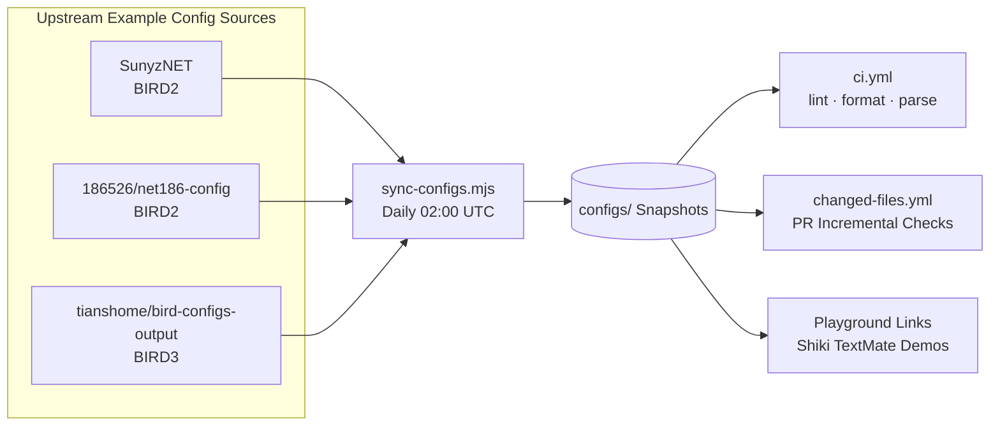

# 🧪 birdcc-ci-test

> Daily sync of real-world BIRD config snapshots, continuously testing `setup-birdcc` via GitHub Actions CI

[](https://github.com/bird-chinese-community/birdcc-ci-test/actions/workflows/ci.yml) [](https://github.com/bird-chinese-community/birdcc-ci-test/actions/workflows/sync-configs.yml)  

[English Version](./README.md) | 中文文档

> Overview · Snapshot Matrix · CI Coverage · Daily Sync · Playground Demos · License Notes

---

## Overview

`birdcc-ci-test` is the integration test repository for [`bird-chinese-community/setup-birdcc`](https://github.com/bird-chinese-community/setup-birdcc). Instead of relying on handcrafted test cases, it continuously pulls and tests BIRD configuration snapshots from multiple real-world scenarios, verifying daily via CI that `setup-birdcc` still functions correctly.

Primary objectives of the repository:

- Mirror upstream BIRD example configurations into `configs/`
- Record source provenance in [`configs/ci-lock.json`](./configs/ci-lock.json)
- Run `birdcc fmt --check`, `birdcc lint --bird`, and direct parse checks with `bird -p -c`
- Scheduled sync jobs trigger full CI runs (not skipped) to ensure end-to-end validation

## Snapshot Matrix

| Snapshot      | Upstream Source                                                                     | BIRD Version | Local Entry Point               | Description                                                                                      |
| ------------- | ----------------------------------------------------------------------------------- | ------------ | ------------------------------- | ------------------------------------------------------------------------------------------------ |
| `sunyznet`    | [`SunyzNET/bird-config`](https://github.com/SunyzNET/bird-config)                   | 2            | `configs/sunyznet/bird.conf`    | Flat multi-file include structure; ideal for testing policies, filters, and constant defines.    |
| `net186`      | [`186526/net186-config`](https://github.com/186526/net186-config)                   | 2            | `configs/net186/bird.conf`      | Nested directories (`bird/`, `lib/`, `protocol/`, `util/`); tests directory-level includes.      |
| `bird3/nycm1` | [`tianshome/bird-configs-output`](https://github.com/tianshome/bird-configs-output) | 3            | `configs/bird3/nycm1/bird.conf` | Real BIRD3 configuration; validates formatter, parser, and installed BIRD3 binary compatibility. |

## CI Coverage

| Workflow                                                     | Trigger Condition                                       | Verification Performed                                                                                                                                      |
| ------------------------------------------------------------ | ------------------------------------------------------- | ----------------------------------------------------------------------------------------------------------------------------------------------------------- |
| [`ci.yml`](./.github/workflows/ci.yml)                       | push / PR / manual dispatch                             | Format check, lint, and `bird -p -c` parse validation across all snapshots                                                                                  |
| [`changed-files.yml`](./.github/workflows/changed-files.yml) | PR modifying `configs/**/*.conf` or `configs/**/*.bird` | Format check only on changed files; reruns lint / parse for affected snapshots                                                                              |
| [`sync-configs.yml`](./.github/workflows/sync-configs.yml)   | Daily `02:00 UTC` / manual dispatch                     | Refreshes upstream snapshots, commits only real diffs, and explicitly dispatches `ci.yml` so the daily canary still runs even when the push is bot-authored |

All workflows utilize [`bird-chinese-community/setup-birdcc@main`](https://github.com/bird-chinese-community/setup-birdcc), making this repository a continuous validation environment for that Action.

## Daily Sync

The sync mechanism is inspired by the config auto‑fetching approach in `BIRD-LSP`, ensuring CI always runs against the latest real‑world configurations.



### Core scripts

- [`scripts/config-sources-registry.mjs`](./scripts/config-sources-registry.mjs) defines upstream snapshot sources
- [`scripts/sync-configs.mjs`](./scripts/sync-configs.mjs) handles cloning, updating, copying, and minimal local adaptation
- [`configs/ci-lock.json`](./configs/ci-lock.json) records the exact upstream commit mirrored
- the sync workflow explicitly dispatches [`ci.yml`](./.github/workflows/ci.yml) after refresh, because a `GITHUB_TOKEN` bot push does not reliably fan out into normal `push` workflow runs

To add a new configuration source:

1. Add the source definition in `scripts/config-sources-registry.mjs`
2. If extra handling is needed, supplement safe post‑sync steps in `scripts/sync-configs.mjs`
3. Run `node scripts/sync-configs.mjs`
4. Include the new snapshot in the CI matrix and README table

## Playground Demos

> [!NOTE]
> Because GitHub does not provide syntax highlighting for BIRD configuration files, this repository offers Playground links based on the [`BIRD` TextMate language grammar](https://github.com/bird-chinese-community/BIRD-tm-language-grammar) for online preview.

- **SunyzNET constants / bogon policies**
  - Source: [`configs/sunyznet/constant.conf`](./configs/sunyznet/constant.conf)
  - Playground: [Open Demo][SunyzNET_Preview]
- **net186 startup configuration**
  - Source: [`configs/net186/config.conf`](./configs/net186/config.conf)
  - Playground: [Open Demo][net186_Preview]
- **BIRD3 `nycm1` core snippet**
  - Source: [`configs/bird3/nycm1/bird.conf`](./configs/bird3/nycm1/bird.conf)
  - Playground: [Open Demo][BIRD3_nycm1_Preview]

Each demo link embeds a concise example with a comment referencing the source file path for traceability.

### Manual Upstream Sync

```bash
cd /path/to/birdcc-ci-test
node scripts/sync-configs.mjs --verbose
```

## License Notes

This repository primarily mirrors third‑party BIRD configuration snapshots to support CI testing and documentation.

- Copyright and licensing of upstream configurations belong to their original repositories.
- The upstream commit currently mirrored is recorded in [`configs/ci-lock.json`](./configs/ci-lock.json).
- `licenseSpdx: "NOASSERTION"` indicates that no explicit SPDX license identifier was obtained at initialization time.

If you intend to use these snapshots for other purposes, please first consult the upstream repositories and their license terms. **We do not attach any new license statements to the mirrored configuration contents.**

[SunyzNET_Preview]: https://textmate-grammars-themes.netlify.app/?theme=tokyo-night&grammar=bird2&code=%23%20From%20https%3A%2F%2Fgithub.com%2Fbird-chinese-community%2Fbirdcc-ci-test%2Fblob%2Fmain%2Fconfigs%2Fsunyznet%2Fconstant.conf%0A%0Adefine%20ASN_LOCAL%20%3D%20150289%3B%0A%0Adefine%20BOGON_ASNS%20%3D%20%5B%0A%20%20%20%200%2C%20%20%20%20%20%20%20%20%20%20%20%20%20%20%20%20%20%20%20%20%20%20%23%20RFC%207607%0A%20%20%20%2023456%2C%20%20%20%20%20%20%20%20%20%20%20%20%20%20%20%20%20%20%23%20RFC%204893%20AS_TRANS%0A%20%20%20%2064496..64511%2C%20%20%20%20%20%20%20%20%20%20%20%23%20RFC%205398%20documentation%2Fexample%20ASNs%0A%20%20%20%2064512..65534%2C%20%20%20%20%20%20%20%20%20%20%20%23%20RFC%206996%20Private%20ASNs%0A%20%20%20%2065535%2C%20%20%20%20%20%20%20%20%20%20%20%20%20%20%20%20%20%20%23%20RFC%207300%20Last%2016%20bit%20ASN%0A%20%20%20%2065536..65551%2C%20%20%20%20%20%20%20%20%20%20%20%23%20RFC%205398%20documentation%2Fexample%20ASNs%0A%20%20%20%2065552..131071%2C%20%20%20%20%20%20%20%20%20%20%23%20RFC%20IANA%20reserved%20ASNs%0A%20%20%20%204200000000..4294967294%2C%20%23%20RFC%206996%20Private%20ASNs%0A%20%20%20%204294967295%20%20%20%20%20%20%20%20%20%20%20%20%20%20%23%20RFC%207300%20Last%2032%20bit%20ASN%0A%5D%3B%0A%0Adefine%20BOGON_PREFIXES_V4%20%3D%20%5B%0A%20%20%20%200.0.0.0%2F8%2B%2C%20%20%20%20%20%20%20%20%20%20%20%20%20%23%20RFC%201122%20this%20network%0A%20%20%20%2010.0.0.0%2F8%2B%2C%20%20%20%20%20%20%20%20%20%20%20%20%23%20RFC%201918%20private%20space%0A%20%20%20%20100.64.0.0%2F10%2B%2C%20%20%20%20%20%20%20%20%20%23%20RFC%206598%20Carrier%20grade%20NAT%20space%0A%20%20%20%20127.0.0.0%2F8%2B%2C%20%20%20%20%20%20%20%20%20%20%20%23%20RFC%201122%20localhost%0A%20%20%20%20169.254.0.0%2F16%2B%2C%20%20%20%20%20%20%20%20%23%20RFC%203927%20link%20local%0A%20%20%20%20172.16.0.0%2F12%2B%2C%20%20%20%20%20%20%20%20%20%23%20RFC%201918%20private%20space%0A%20%20%20%20192.168.0.0%2F16%2B%2C%20%20%20%20%20%20%20%20%23%20RFC%201918%20private%20space%0A%20%20%20%20224.0.0.0%2F4%2B%2C%20%20%20%20%20%20%20%20%20%20%20%23%20multicast%0A%20%20%20%20240.0.0.0%2F4%2B%20%20%20%20%20%20%20%20%20%20%20%20%23%20reserved%0A%5D%3B
[net186_Preview]: https://textmate-grammars-themes.netlify.app/?theme=tokyo-night&grammar=bird2&code=%23%20From%20https%3A%2F%2Fgithub.com%2Fbird-chinese-community%2Fbirdcc-ci-test%2Fblob%2Fmain%2Fconfigs%2Fnet186%2Fconfig.conf%0A%0Arouter%20id%2010.0.0.101%3B%0A%0Adefine%20LOCAL_ASN%20%3D%20200536%3B%0Adefine%20POP%20%3D%20101%3B%0Adefine%20REGION%20%3D%20100%3B%0Adefine%20SELFASN%20%3D%204200000101%3B%0Adefine%20ROUTER_IP%20%3D%202a0a%3A6040%3Aa901%3A%3A1%3B%0A%0Aprotocol%20static%20%7B%0A%20%20ipv4%3B%0A%20%20route%2010.0.0.0%2F24%20unreachable%3B%0A%7D%0A%0Aprotocol%20kernel%20%7B%0A%20%20ipv4%20%7B%0A%20%20%20%20import%20none%3B%0A%20%20%20%20export%20filter%20%7B%0A%20%20%20%20%20%20if%20source%20%3D%20RTS_STATIC%20then%20accept%3B%0A%20%20%20%20%20%20reject%3B%0A%20%20%20%20%7D%3B%0A%20%20%7D%3B%0A%7D
[BIRD3_nycm1_Preview]: https://textmate-grammars-themes.netlify.app/?theme=tokyo-night&grammar=bird2&code=%23%20From%20https%3A%2F%2Fgithub.com%2Fbird-chinese-community%2Fbirdcc-ci-test%2Fblob%2Fmain%2Fconfigs%2Fbird3%2Fnycm1%2Fbird.conf%0A%0Arouter%20id%2010.0.0.127%3B%0A%0Adefine%20LOCAL_v4%20%3D%20%5B%0A%20%2010.30.0.0%2F16%2B%2C%0A%20%2010.24.0.0%2F16%2B%2C%0A%20%20192.168.1.0%2F24%2B%0A%5D%3B%0A%0Afilter%20local_v4_only%20%7B%0A%20%20if%20dest%20%3D%20RTD_UNREACHABLE%20then%20reject%3B%0A%20%20if%20(net%20~%20LOCAL_v4)%20then%20accept%3B%0A%20%20reject%3B%0A%7D%3B%0A%0Aprotocol%20kernel%20kernel_v4%20%7B%0A%20%20learn%3B%0A%20%20ipv4%20%7B%0A%20%20%20%20import%20filter%20%7B%0A%20%20%20%20%20%20if%20net%20%3D%200.0.0.0%2F0%20then%20reject%3B%0A%20%20%20%20%20%20accept%3B%0A%20%20%20%20%7D%3B%0A%20%20%20%20export%20filter%20local_v4_only%3B%0A%20%20%7D%3B%0A%7D%0A%0Aprotocol%20bgp%20upstream4%20%7B%0A%20%20local%2010.30.0.2%20as%2065000%3B%0A%20%20neighbor%2010.30.0.1%20as%2065001%3B%0A%20%20ipv4%20%7B%0A%20%20%20%20import%20filter%20%7B%0A%20%20%20%20%20%20if%20(net%20~%20LOCAL_v4)%20then%20reject%3B%0A%20%20%20%20%20%20accept%3B%0A%20%20%20%20%7D%3B%0A%20%20%20%20expor
