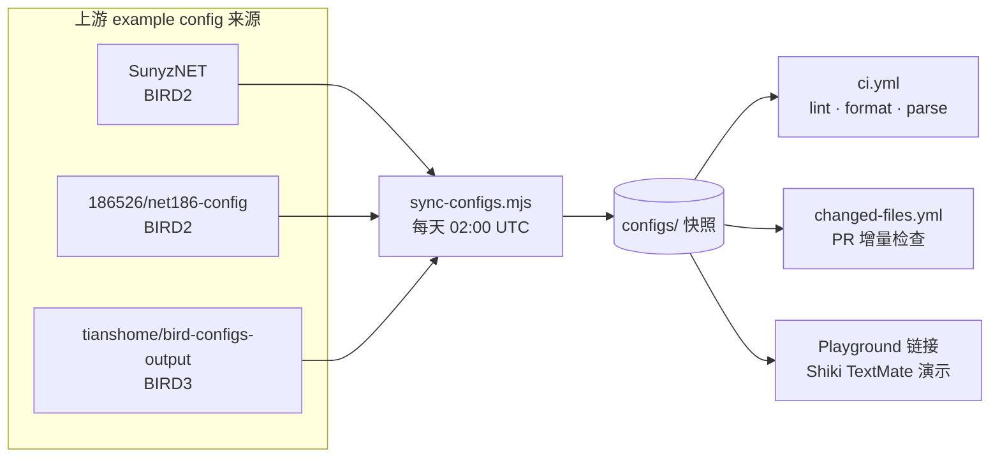

# 🧪 birdcc-ci-test

> 每日同步真实 BIRD 配置快照，并持续用 GitHub Actions CI 压测 `setup-birdcc`。

[](https://github.com/bird-chinese-community/birdcc-ci-test/actions/workflows/ci.yml)
[](https://github.com/bird-chinese-community/birdcc-ci-test/actions/workflows/sync-configs.yml)


[English Version](./README.md) | 中文文档

> [概述](#概述) · [快照矩阵](#快照矩阵) · [CI 覆盖面](#ci-覆盖面) · [每日同步](#每日同步) · [Playground 演示](#playground-演示) · [目录结构](#目录结构) · [许可证说明](#许可证说明)

---

## 概述

`birdcc-ci-test` 是 [`bird-chinese-community/setup-birdcc`](https://github.com/bird-chinese-community/setup-birdcc) 的实战试验场。它不是只拿几个极小的伪造 fixture 跑一下，而是持续镜像一组真实世界里的 BIRD 配置快照，并且每天重新跑一遍 CI。

这个仓库要回答的问题非常朴素：

> 明天早上把 `setup-birdcc` 指向真实的 BIRD2 / BIRD3 配置树时，它还稳不稳？

这个仓库会做这些事：

- 将上游 BIRD example config 镜像到 `configs/`
- 将来源元数据记录在 [`configs/ci-lock.json`](./configs/ci-lock.json)
- 运行 `birdcc fmt --check`、`birdcc lint --bird`，以及直接执行 `bird -p -c` 冒烟检查
- 每日同步时**故意不使用** `[skip ci]`，让定时更新也顺带压一遍完整 CI 稳健性

> [!NOTE]
> GitHub 网页目前仍然不能原生高亮 BIRD 配置文件，所以这里额外准备了基于 `bird2` TextMate grammar 的可分享 Playground 链接。

## 快照矩阵

| 快照 | 上游来源 | BIRD | 本地入口 | 价值 |
| --- | --- | --- | --- | --- |
| `sunyznet` | [`SunyzNET/bird-config`](https://github.com/SunyzNET/bird-config) | 2 | `configs/sunyznet/bird.conf` | 扁平多文件 include 结构，适合覆盖策略 / filter / 常量定义 |
| `net186` | [`186526/net186-config`](https://github.com/186526/net186-config) | 2 | `configs/net186/bird.conf` | 带 `bird/`、`lib/`、`protocol/`、`util/` 的嵌套目录结构，能覆盖目录 include 场景 |
| `bird3/nycm1` | [`tianshome/bird-configs-output`](https://github.com/tianshome/bird-configs-output) | 3 | `configs/bird3/nycm1/bird.conf` | 真实 BIRD3 语法路径，用于验证 formatter、parser 和安装后的 BIRD3 二进制 |

> [!TIP]
> `net186` 这份快照有一个非常小的 CI 适配：会把 `config-example.conf` 复制成 `config.conf`，并启用 `bird.conf` 里的对应 include。这样镜像出来的配置树才能作为可直接跑的顶层入口参与 CI。

## CI 覆盖面

| Workflow | 触发方式 | 它验证什么 |
| --- | --- | --- |
| [`ci.yml`](./.github/workflows/ci.yml) | push / PR / 手动触发 | 对全部快照做矩阵化 format、lint、直接 `bird -p -c` parse smoke |
| [`changed-files.yml`](./.github/workflows/changed-files.yml) | PR 修改 `configs/**/*.conf` 或 `configs/**/*.bird` | 对改动文件做 format check，并只重跑受影响的顶层快照 lint / parse |
| [`sync-configs.yml`](./.github/workflows/sync-configs.yml) | 每天 `02:00 UTC` / 手动触发 | 从上游拉取新快照、更新 `configs/ci-lock.json`，提交并推送，而且**不跳过 CI** |

所有工作流都故意使用 [`bird-chinese-community/setup-birdcc@main`](https://github.com/bird-chinese-community/setup-birdcc)，这样这个仓库就像一个滚动更新的集成金丝雀，持续验证 action 的最新主分支。

## 每日同步

这套同步机制参考了 `BIRD-LSP` 里自动拉取 config examples 的基建思路，但这里更偏向一个目标：让 CI 每天都说真话。



核心文件很少，职责也比较清楚：

- [`scripts/config-sources-registry.mjs`](./scripts/config-sources-registry.mjs) 定义上游快照来源目录
- [`scripts/sync-configs.mjs`](./scripts/sync-configs.mjs) 负责 clone / refresh / copy，并在必要时施加很小的本地适配
- [`configs/ci-lock.json`](./configs/ci-lock.json) 记录当前镜像对应的上游 commit

如果你想继续增加新的 example source，通常只需要：

1. 在 `scripts/config-sources-registry.mjs` 里添加来源定义
2. 如有必要，在 `scripts/sync-configs.mjs` 里补一个安全的 post-sync 适配
3. 运行 `node scripts/sync-configs.mjs`
4. 把新快照加入 CI matrix 和 README 表格

## Playground 演示

GitHub 现在能渲染 Mermaid，但对 BIRD config 代码高亮仍然比较“佛系”。所以这里另外准备了几个可直接分享的 Playground 演示链接。

| 演示 | 源文件 | Playground |
| --- | --- | --- |
| SunyzNET 常量 / bogon 策略 | [`configs/sunyznet/constant.conf`](./configs/sunyznet/constant.conf) | [打开演示](https://textmate-grammars-themes.netlify.app/?theme=tokyo-night&grammar=bird2&code=%23%20From%20https%3A%2F%2Fgithub.com%2Fbird-chinese-community%2Fbirdcc-ci-test%2Fblob%2Fmain%2Fconfigs%2Fsunyznet%2Fconstant.conf%0A%0Adefine%20ASN_LOCAL%20%3D%20150289%3B%0A%0Adefine%20BOGON_ASNS%20%3D%20%5B%0A%20%20%20%200%2C%20%20%20%20%20%20%20%20%20%20%20%20%20%20%20%20%20%20%20%20%20%20%23%20RFC%207607%0A%20%20%20%2023456%2C%20%20%20%20%20%20%20%20%20%20%20%20%20%20%20%20%20%20%23%20RFC%204893%20AS_TRANS%0A%20%20%20%2064496..64511%2C%20%20%20%20%20%20%20%20%20%20%20%23%20RFC%205398%20documentation%2Fexample%20ASNs%0A%20%20%20%2064512..65534%2C%20%20%20%20%20%20%20%20%20%20%20%23%20RFC%206996%20Private%20ASNs%0A%20%20%20%2065535%2C%20%20%20%20%20%20%20%20%20%20%20%20%20%20%20%20%20%20%23%20RFC%207300%20Last%2016%20bit%20ASN%0A%20%20%20%2065536..65551%2C%20%20%20%20%20%20%20%20%20%20%20%23%20RFC%205398%20documentation%2Fexample%20ASNs%0A%20%20%20%2065552..131071%2C%20%20%20%20%20%20%20%20%20%20%23%20RFC%20IANA%20reserved%20ASNs%0A%20%20%20%204200000000..4294967294%2C%20%23%20RFC%206996%20Private%20ASNs%0A%20%20%20%204294967295%20%20%20%20%20%20%20%20%20%20%20%20%20%20%23%20RFC%207300%20Last%2032%20bit%20ASN%0A%5D%3B%0A%0Adefine%20BOGON_PREFIXES_V4%20%3D%20%5B%0A%20%20%20%200.0.0.0%2F8%2B%2C%20%20%20%20%20%20%20%20%20%20%20%20%20%23%20RFC%201122%20this%20network%0A%20%20%20%2010.0.0.0%2F8%2B%2C%20%20%20%20%20%20%20%20%20%20%20%20%23%20RFC%201918%20private%20space%0A%20%20%20%20100.64.0.0%2F10%2B%2C%20%20%20%20%20%20%20%20%20%23%20RFC%206598%20Carrier%20grade%20NAT%20space%0A%20%20%20%20127.0.0.0%2F8%2B%2C%20%20%20%20%20%20%20%20%20%20%20%23%20RFC%201122%20localhost%0A%20%20%20%20169.254.0.0%2F16%2B%2C%20%20%20%20%20%20%20%20%23%20RFC%203927%20link%20local%0A%20%20%20%20172.16.0.0%2F12%2B%2C%20%20%20%20%20%20%20%20%20%23%20RFC%201918%20private%20space%0A%20%20%20%20192.168.0.0%2F16%2B%2C%20%20%20%20%20%20%20%20%23%20RFC%201918%20private%20space%0A%20%20%20%20224.0.0.0%2F4%2B%2C%20%20%20%20%20%20%20%20%20%20%20%23%20multicast%0A%20%20%20%20240.0.0.0%2F4%2B%20%20%20%20%20%20%20%20%20%20%20%20%23%20reserved%0A%5D%3B) |
| net186 启动配置 | [`configs/net186/config.conf`](./configs/net186/config.conf) | [打开演示](https://textmate-grammars-themes.netlify.app/?theme=tokyo-night&grammar=bird2&code=%23%20From%20https%3A%2F%2Fgithub.com%2Fbird-chinese-community%2Fbirdcc-ci-test%2Fblob%2Fmain%2Fconfigs%2Fnet186%2Fconfig.conf%0A%0Arouter%20id%2010.0.0.101%3B%0A%0Adefine%20LOCAL_ASN%20%3D%20200536%3B%0Adefine%20POP%20%3D%20101%3B%0Adefine%20REGION%20%3D%20100%3B%0Adefine%20SELFASN%20%3D%204200000101%3B%0Adefine%20ROUTER_IP%20%3D%202a0a%3A6040%3Aa901%3A%3A1%3B%0A%0Aprotocol%20static%20%7B%0A%20%20ipv4%3B%0A%20%20route%2010.0.0.0%2F24%20unreachable%3B%0A%7D%0A%0Aprotocol%20kernel%20%7B%0A%20%20ipv4%20%7B%0A%20%20%20%20import%20none%3B%0A%20%20%20%20export%20filter%20%7B%0A%20%20%20%20%20%20if%20source%20%3D%20RTS_STATIC%20then%20accept%3B%0A%20%20%20%20%20%20reject%3B%0A%20%20%20%20%7D%3B%0A%20%20%7D%3B%0A%7D) |
| BIRD3 `nycm1` 核心片段 | [`configs/bird3/nycm1/bird.conf`](./configs/bird3/nycm1/bird.conf) | [打开演示](https://textmate-grammars-themes.netlify.app/?theme=tokyo-night&grammar=bird2&code=%23%20From%20https%3A%2F%2Fgithub.com%2Fbird-chinese-community%2Fbirdcc-ci-test%2Fblob%2Fmain%2Fconfigs%2Fbird3%2Fnycm1%2Fbird.conf%0A%0Arouter%20id%2010.0.0.127%3B%0A%0Adefine%20LOCAL_v4%20%3D%20%5B%0A%20%2010.30.0.0%2F16%2B%2C%0A%20%2010.24.0.0%2F16%2B%2C%0A%20%20192.168.1.0%2F24%2B%0A%5D%3B%0A%0Afilter%20local_v4_only%20%7B%0A%20%20if%20dest%20%3D%20RTD_UNREACHABLE%20then%20reject%3B%0A%20%20if%20(net%20~%20LOCAL_v4)%20then%20accept%3B%0A%20%20reject%3B%0A%7D%3B%0A%0Aprotocol%20kernel%20kernel_v4%20%7B%0A%20%20learn%3B%0A%20%20ipv4%20%7B%0A%20%20%20%20import%20filter%20%7B%0A%20%20%20%20%20%20if%20net%20%3D%200.0.0.0%2F0%20then%20reject%3B%0A%20%20%20%20%20%20accept%3B%0A%20%20%20%20%7D%3B%0A%20%20%20%20export%20filter%20local_v4_only%3B%0A%20%20%7D%3B%0A%7D%0A%0Aprotocol%20bgp%20upstream4%20%7B%0A%20%20local%2010.30.0.2%20as%2065000%3B%0A%20%20neighbor%2010.30.0.1%20as%2065001%3B%0A%20%20ipv4%20%7B%0A%20%20%20%20import%20filter%20%7B%0A%20%20%20%20%20%20if%20(net%20~%20LOCAL_v4)%20then%20reject%3B%0A%20%20%20%20%20%20accept%3B%0A%20%20%20%20%7D%3B%0A%20%20%20%20export%20all%3B%0A%20%20%7D%3B%0A%7D) |

这些 Playground URL 里内嵌了一个较短、便于分享的代码片段，同时也会在代码注释里保留 `# From ...` 源链接，方便后续传播时仍然知道它来自哪里。

## 目录结构

```text
.
├── .github/workflows/
│   ├── ci.yml
│   ├── changed-files.yml
│   └── sync-configs.yml
├── configs/
│   ├── bird3/nycm1/
│   ├── net186/
│   ├── sunyznet/
│   └── ci-lock.json
└── scripts/
  ├── config-sources-registry.mjs
  └── sync-configs.mjs
```

### 本地手动同步一次

```bash
cd /path/to/birdcc-ci-test
node scripts/sync-configs.mjs --verbose
```

## 许可证说明

这个仓库主要用于镜像第三方配置快照，以便做 CI 测试和文档展示。

- 上游配置的所有权和许可证仍然属于原始仓库
- 当前镜像对应的上游 commit 信息记录在 [`configs/ci-lock.json`](./configs/ci-lock.json)
- `licenseSpdx: "NOASSERTION"` 表示在初始化该来源时，没有获取到明确的 SPDX 许可证标识

如果你打算把这些快照拿到这个 CI Playground 之外的环境中复用，请先阅读上游仓库及其许可证条款。这里不会对镜像来的配置内容额外宣称新的许可证。
